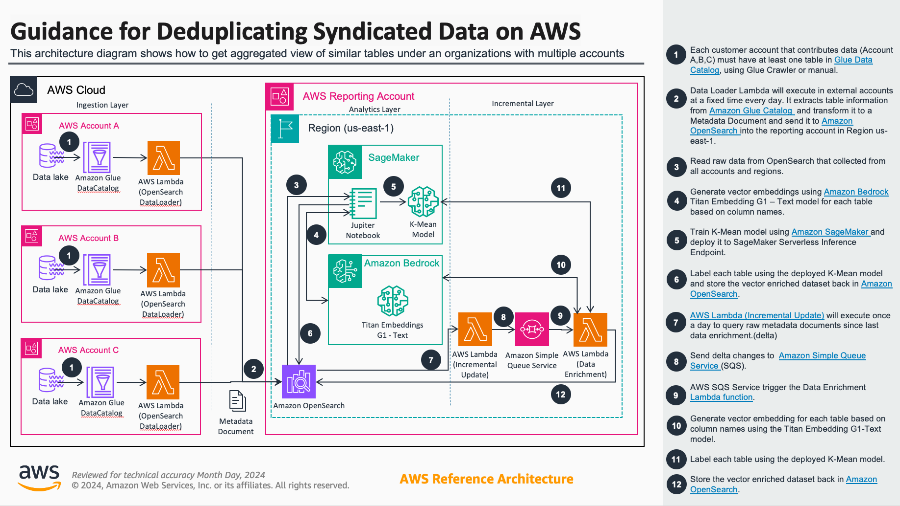

# Guidance for Mastering Syndicated Data on AWS

## Table of Content

List the top-level sections of the README template, along with a hyperlink to the specific section.

### Required

1. [Overview](#overview)
    - [Cost](#cost)
2. [Prerequisites](#prerequisites)
    - [Operating System](#operating-system)
3. [Deployment](#deployment)
4. [Deployment Validation](#deployment-validation)
5. [Running the Guidance](#running-the-guidance)
6. [Next Steps](#next-steps)
7. [Cleanup](#cleanup)
8.  [Authors](#authors)

## Overview

Large Organizations often adopt Datalake concept to centralize data pertaining to different business units. Each business unit in these organizations often purchase and create data autonomously and generate large amount of duplicate datasets.

This guidance enables these large customers to find duplicate datasets in Data lakes across multiple accounts. This solution allows business users to search data tables to find same or similar datasets and enables procurement processes to access a searchable inventory and thus could avoid purchase of same data sets multiple times.




### Cost

[budget](https://calculator.aws/#/estimate?id=214ad9dd9ff23aa8726ec2986f2f1de5c4873b10)


You are responsible for the cost of the AWS services used while running this Guidance. As of July 2024, the cost for running this Guidance with the default settings in the  US East (N. Virginia) is approximately $1,449.30 USD per month for processing 10,000 tables over 25 AWS accounts.

### Sample Cost Table

The following table provides a sample cost breakdown for deploying this Guidance with the default parameters in the US East (N. Virginia) Region for one month.

| AWS service  | Dimensions | Cost [USD] |
| ----------- | ------------ | ------------ |
AWS Lambda | Data Loader: 31 invokations per month | $ 0.03 |
Amazon OpenSearch Service | search: 2 Index OCU, 2 query OCU, 1 GB Index  | $ 700.82 |
Amazon OpenSearch Service | vector: 2 Index OCU, 2 query OCU, 1 GB Index  | $ 700.82 |
Amazon Simple Queue Service (SQS) | 1,000,000 per month | $ 0.00 |
Amazon SageMaker on-demand Notebook| ml.c4.xlarge, 1 Data Scientist, 1 notebook 5 hours per month |$ 4.85 |
Amazon SageMaker | 250,000 requests per month avg duration 7000 ms |$ 35.00 |
Amazon Bedrock | 250,000 requests per month | $ 0.03 |
AWS Lambda | Incremental Update: 31 invokations per month | $ 1.58 |
AWS Lambda | Enrichment: 250,000 invokations per month| $ 6.17 |

## Prerequisites

### Operating System

- This guide can be operated on any personal or server Operating System (OS) such as *Mac, Linux, or Windows* that include a **terminal** as well as on Cloud Environments. i.e., AWS EC2, AWS Cloud9.


### Third-party tools

1. A Terminal Interface
2. AWS CLI. [install instructions here](https://docs.aws.amazon.com/cli/latest/userguide/getting-started-install.html)
3. Node.js 14.15.0 or later [install instructions here](https://nodejs.org/en/download/)
4. AWS CDK CLI [getting started guide](https://docs.aws.amazon.com/cdk/v2/guide/getting_started.html)
5. Python 3.11 (virtual environment preferred)

### Python virtual environment creation
To manually create a virtualenv on MacOS and Linux:

```
$ python3 -m venv .venv
```

After the init process completes and the virtualenv is created, you can use the following
step to activate your virtualenv.

```
$ source .venv/bin/activate
```

If you are a Windows platform, you would activate the virtualenv like this:

```
% .venv\Scripts\activate.bat
```

### AWS account requirements

This deployment requires you have permissions to deploy CloudFormation templates in your AWS account

**Deeployable resources:**
- CloudFormation Stacks
- SQS
- OpenSearch Serverless Collections
- IAM roles and policies
- Lambdas


### aws cdk bootstrap

This Guidance uses aws-cdk. If you are using aws-cdk for first time, please follow [**cdk getting started guide**](https://docs.aws.amazon.com/cdk/v2/guide/getting_started.html) first and perform the below bootstrapping in every AWS Account you will deploy.

Make sure you have AWS credentials available in your terminal and run:

```shell
cdk bootstrap
```

### Supported Regions

 OpenSearch Serverless is now available in eight AWS Regions globally: US East (Ohio), US East (N. Virginia), US West (Oregon), Asia Pacific (Singapore), Asia Pacific (Sydney), Asia Pacific (Tokyo), Europe (Frankfurt), and Europe (Ireland).

 Check updates here: https://aws.amazon.com/about-aws/whats-new/2023/01/amazon-opensearch-serverless-available

## Deployment

### Deploy Prerequisites

1. Install [3rd Party tools](#third-party-tools)
2. Clone the repo using command:
```shell
git clone https://github.com/aws-solutions-library-samples/guidance-for-mastering-syndicated-data-on-aws.git
```
3. cd to the *source* folder in repo ```cd guidance-for-mastering-syndicated-data-on-aws/source```
4. Make sure you have a python environment active. See [here](#python-virtual-environment-creation) how.

5. Install packages in requirements using commands
```shell
pip install -r requirements.txt
pip install -r requirements-dev.txt
```


### Deploy Step 00 - cdk bootstrap - *Main* & *Secondary* accounts

Set AWS credentials for the **Account** where the infrastructure will be deployed and run **cdk bootstrap**

```shell
cdk bootstrap
```

### Deploy Step 01 - RolesStack Deployment - *Main* & *Secondary* accounts

This stack contains lambda roles that will be neccesary in other stacks. Without this other stacks will fail to deploy or not work correctly.

```shell
cdk deploy RolesStack
```

### Deploy Step 02 - SearchContentStack Deployment - *Main* account only

* EXPRINCIPALS: Contains a comma separated list of *Principal* arn's, 3 from the *Main* account that will be used to setup the pipeline and zero or more
 in other AWS accounts (not the *Main* account) that will be authorized to push data into the system using `OpenSearchDataload` lambda deployed with the *DataloadStack*.

Template:
--parameters SearchContentStack:EXPRINCIPALS="<main roles - 3>,<secondary roles - n>"

1. main roles: Only these 3 roles provided here with *Main Account Number* changed
`arn:aws:sts::{Main Account number}:assumed-role/DataLoadStack-ExternalIngestionRole/OpenSearchDataload,arn:aws:sts::{Main Account Number}:assumed-role/LambdasStack-InternalIngestionRole/delta2q,arn:aws:sts::{Main Account Number}:assumed-role/LambdasStack-InternalEnrichmentRole/deltaq2enreachment`

2. secondary roles: As many copies of this unique role per *Secondary* Account you want to use, change `Secondary Account Number` accordingly and separate each copy with a comma.
`arn:aws:sts::{Secondary Account Number}:assumed-role/DataLoadStack-ExternalIngestionRole/OpenSearchDataload`

* ADPRINCIPALS: Contains a comma separated list of *Principals* in *Main* AWS account that will be admins of the system.

Template:
--parameters SearchContentStack:ADPRINCIPALS="<admin roles - n>"

```shell
cdk deploy SearchContentStack \
--parameters SearchContentStack:EXPRINCIPALS="arn:aws:sts::XXXX:assumed-role/DataLoadStack-ExternalIngestionRole/OpenSearchDataload,arn:aws:sts::YYYY:assumed-role/DataLoadStack-ExternalIngestionRole/OpenSearchDataload" \
--parameters SearchContentStack:ADPRINCIPALS="arn:aws:sts::YYYY:assumed-role/Admin/<user>,arn:aws:sts::YYYY:assumed-role/AmazonSageMakerServiceCatalogProductsUseRole/SageMaker"

```


### Deploy Step 03 - DataLoadStack Deployment - *Main* & *Secondary* accounts

This stack will be deployed in each AWS Account authorized to push data into the system. Deployment must be executed on each account independently by following steps: *00, 01 and 04 of this guide*.


* region: The AWS Region where the data will be collected.
* ingestRole: The arn of the authorized role to be used to push data. Use the pattern below with the appropriate AWS account used an *Main*.
* osHost: The OpenSearch *Search* Collection host where the data will be pushed. Go to CloudFormation -> SearchContentStack -> Outputs to get it.
* osIndex: The OpenSearch index name where the data will be pushed.
* externalId: The security Id necessary to push data into OpenSearch. This value has been hardcoded in `search_content/config.py` and should be changed.

```shell
cdk deploy DataLoadStack \
--parameters DataLoadStack:region="us-east-1" \
--parameters DataLoadStack:ingestRole="arn:aws:iam::YYYY:role/ingest-searchable-content" \
--parameters DataLoadStack:osHost="https://9v6e0jlve45rb3tj4o1f.us-east-1.aoss.amazonaws.com" \
--parameters DataLoadStack:osIndex="raw" \
--parameters DataLoadStack:externalId="ValorExternou8n4Fh4hFSauHbsm"

```


### Deploy Step 04 - LambdasStack Deployment - *Main* account only

* searchIndex: is the name of the search index deployed in *SearchContentStack*. Default: `raw`

* vectorIndex: is the name of the vector index deployed in *SearchContentStack*. Default: `fultable_dedup`

* kmeanEndpoint: is the deployed endpoint on SageMaker using the [Train_K-Mean_Model.ipynb](source/Train_K-Mean_Model.ipynb) Jupiter notebook. Please open the Jupiter notebook in SageMaker and execute it to get the K-Means model trained and delpoyed.

See `search_content/config.py` for other default details.

```shell
cdk deploy LambdasStack \
--parameters LambdasStack:searchIndex=raw \
--parameters LambdasStack:vectorIndex=fultable_dedup \
--parameters LambdasStack:kmeanEndpoint=<SageMaker Endpoint> \

```

## Deployment Validation


* Open CloudFormation console and verify the status of each stack deployed:

1. RolesStack
2. SearchContentStack
3. DataLoadStack
4. LambdasStack

* If deployment is successful, you should see a green tick mark in the terminal.
*  Run the following CLI command to validate the deployment: ```cdk diff```


## Running the Guidance

This solution enables business users to find similar tables in documents in a single AWS account or at enterprise level.
This solution leverages Amazon OpenSearch to store metadata information of all documents in various data lakes across multiple accounts create and store vector embeddings using Amazon bedrock and Titan model for this metadata and use K-Means model on Amazon SageMaker to find the similarities between the documents.

Below diagram depicts the high-level data flow and Architecture Building Blocks to achieve this goal.


1. At Data Load each AWS account with data stored could independently and with full autonomy participate in the solution. Opting in or out at will and without overhead in current operations
2. Then the data needs to be classified to be ready for queries. Classification leverage Vector embedding
3. Then the vectorized data labeled using a pre-trained K-Mean model.
4. The enriched data stored in a vector database for easy access and query
5. Vector database enables users to easily find tables that similar to each other using the k-mean labels as well as run at hock queries for column names to find similar tables the organization already have.
   
As part of the initial setup after Vector Embedding (Step2), a K-Mean model need to be trained on the raw dataset loaded by the data loader. Overtime retraining the K-Mean model would improve data labeling more accurate.


## Next Steps

Add Data loader for each AWS account in the organization and adjust the configuration options in AWS CDK as needed.

Schedule `Data loader` and `Incremental update` to run once a day. 

## Cleanup

Run `cdk destroy --all` on the terminal to remove all deployed resources per AWS Account.

You can also delete the CloudFormation Stacks from the Console.

## Authors


Akos Jancsik

Ruben Hernandez

Ashish Vashisht
